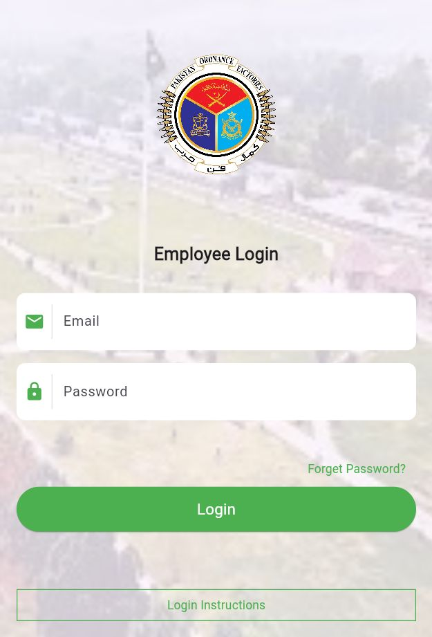
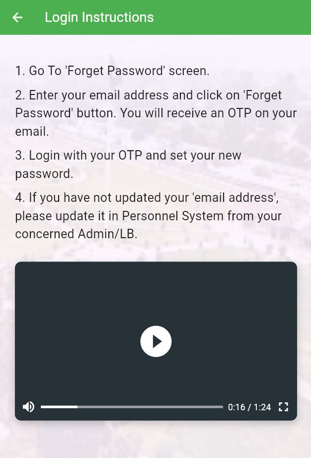
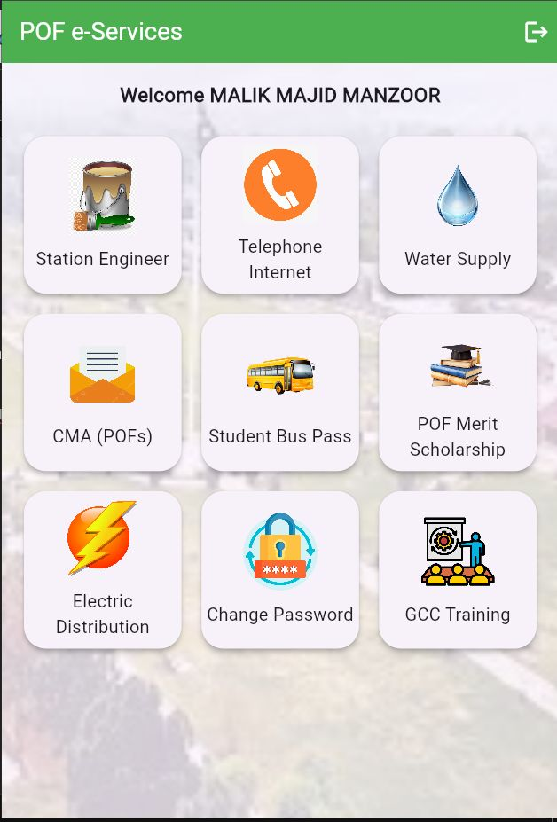
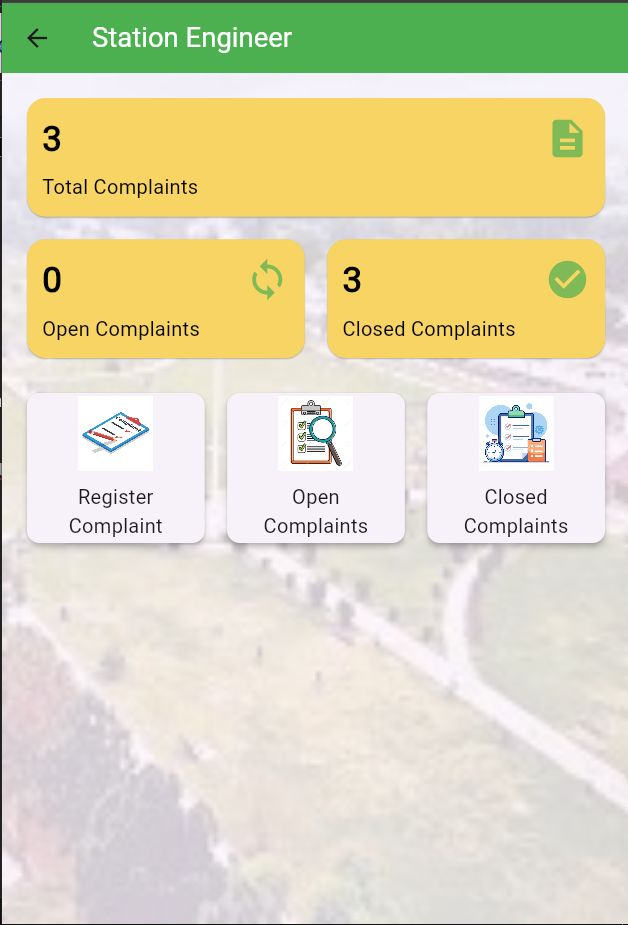
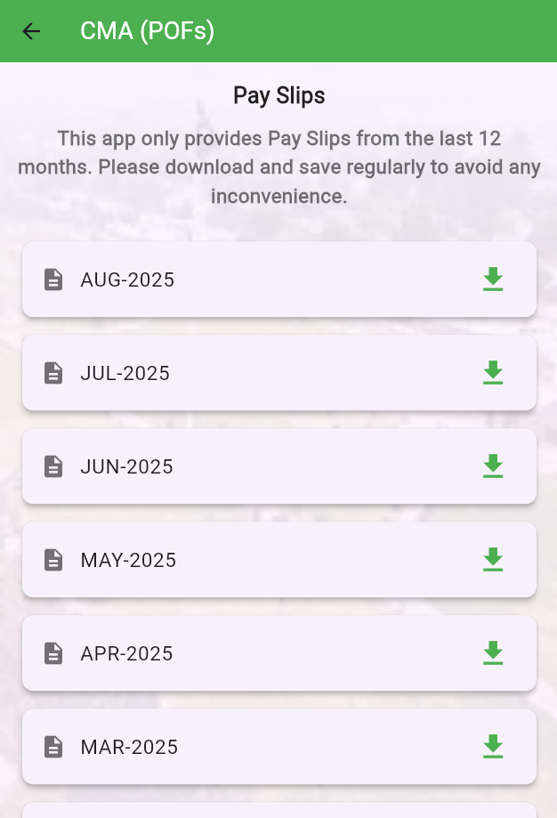
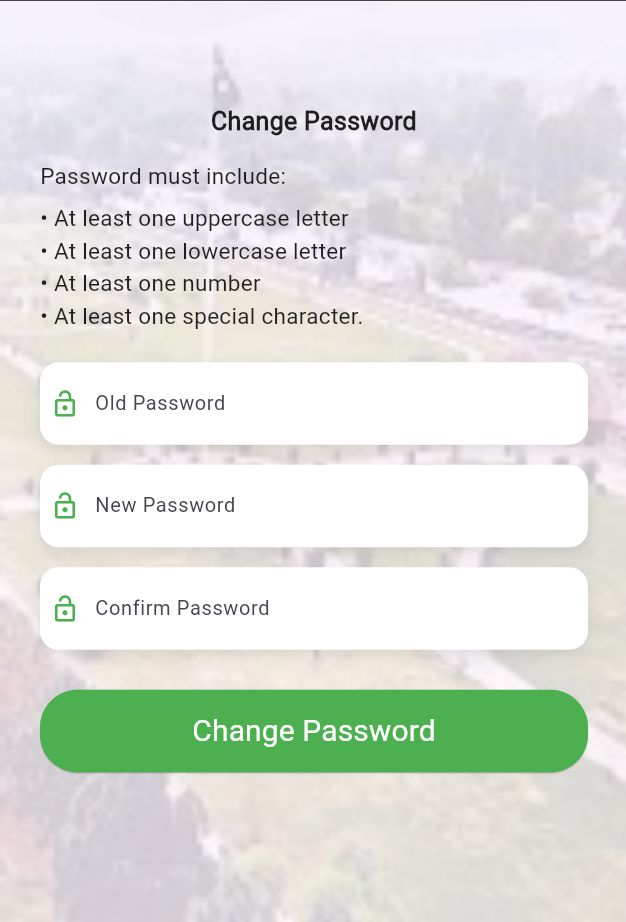

# POF e-Services 🚀

<div align="center">
  


A comprehensive Flutter-based employee services application for Pakistan Ordnance Factories (POF) employees.

</div>

## 📸 Application Screenshots

<div align="center">
    <div style="display: flex; flex-wrap: wrap; justify-content: center; gap: 20px;">
        <div style="text-align: center;">
            <h3>Splash Screen</h3>
            
            <p>*Welcome animation with POF branding*</p>
        </div>

        <div style="text-align: center;">
            <h3>Login Screen</h3>
            
            <p>*Secure authentication interface*</p>
        </div>

        <div style="text-align: center;">
            <h3>Login Instructions</h3>
            
            <p>*Step-by-step guide for account access*</p>
        </div>

        <div style="text-align: center;">
            <h3>Home Screen</h3>
            
            <p>*Main dashboard with service grid*</p>
        </div>

        <div style="text-align: center;">
            <h3>Complaints Overview</h3>
            
            <p>*Complaint management dashboard*</p>
        </div>

        <div style="text-align: center;">
            <h3>CMA/Pay Slips</h3>
            
            <p>*Pay slip management and download*</p>
        </div>

        <div style="text-align: center;">
            <h3>Change Password</h3>
            
            <p>*Secure password update interface*</p>
        </div>
    </div>
</div>

## ✨ Features

### 🔐 Authentication & Security
- **Secure Login System** with Firebase Authentication
- **Password Management** with change password functionality
- **Role-based Access Control**

### 📋 Complaint Management System
- 🆕 **Register New Complaints** with multiple categories
- 👀 **View Open Complaints** with real-time updates
- ✅ **Track Closed Complaints** with timestamps
- 📊 **Complaint Statistics** dashboard

### 💰 Payroll Services
- 📄 **Pay Slip Generation** for last 12 months
- 🌐 **Cross-platform PDF Export** (web and mobile)
- ⬇️ **Easy Download** functionality

### 🏢 Service Categories
- 🔧 Station Engineer Services
- 📞 Telephone & Internet Services
- 💧 Water Supply Management
- 📊 CMA (POFs) Services
- 🚌 Student Bus Pass
- 🎓 POF Merit Scholarship
- ⚡ Electric Distribution
- 🎯 GCC Training

## 🛠️ Technology Stack

- **Frontend Framework**: Flutter 📱
- **Backend Services**: Firebase 🔥
- **Authentication**: Firebase Auth 🔐
- **Database**: Cloud Firestore 💾
- **State Management**: Provider 🧩
- **PDF Generation**: pdf & printing packages 📄
- **File Management**: path_provider 📁

## 🚀 Installation & Setup

### Prerequisites

- Flutter SDK (latest stable version)
- Dart SDK
- Firebase project
- Android/iOS development environment

### Step-by-Step Setup

1. **Clone the repository**
   ```bash
   git clone <repository-url>
   cd pof_e_services
   ```

2. **Install dependencies**
   ```bash
   flutter pub get
   ```

3. **Firebase Configuration**
   - Create a new Firebase project
   - Enable Authentication (Email/Password)
   - Enable Firestore Database
   - Add platform configurations:
     - Android: Add `google-services.json`
     - iOS: Add `GoogleService-Info.plist`
     - Web: Add Firebase config to `web/index.html`

4. **Run the application**
   ```bash
   flutter run
   ```

## 📁 Project Structure

```
lib/
├── screens/
│   ├── splash_screen.dart      # Welcome animation
│   ├── login_screen.dart       # Authentication
│   ├── home_screen.dart        # Main dashboard
│   ├── complaint_screen.dart   # Complaint management
│   ├── register_complaint_screen.dart  # New complaint
│   ├── open_complaints_screen.dart     # Active complaints
│   ├── closed_complaints_screen.dart   # Resolved complaints
│   ├── cma_screen.dart         # Pay slip management
│   └── change_password_screen.dart     # Security
├── services/
│   └── auth_service.dart       # Authentication logic
└── main.dart                   # App entry point
```

## 📦 Dependencies

| Package | Version | Purpose |
|---------|---------|---------|
| flutter | SDK | UI Framework |
| firebase_core | ^4.0.0 | Firebase integration |
| firebase_auth | ^6.0.1 | Authentication |
| cloud_firestore | ^6.0.0 | Database |
| provider | ^6.1.5+1 | State management |
| pdf | ^3.11.3 | PDF generation |
| printing | ^5.14.2 | PDF printing |
| path_provider | ^2.1.5 | File system access |

## 🏗️ Building for Production

### Android APK
```bash
flutter build apk --release
```

### iOS Bundle
```bash
flutter build ios --release
```

### Web Deployment
```bash
flutter build web --release
```

## 🤝 Contributing

We welcome contributions to enhance POF e-Services! Please follow these steps:

1. Fork the repository
2. Create a feature branch (`git checkout -b feature/amazing-feature`)
3. Commit your changes (`git commit -m 'Add amazing feature'`)
4. Push to the branch (`git push origin feature/amazing-feature`)
5. Open a Pull Request

## 📄 License

This project is developed for and owned by Pakistan Ordnance Factories. All rights reserved.

## 🆘 Support

For technical support or questions about this application, please contact:

📧 ahmermoonmajid@gmail.com  
☎️ +92-328-5077511

---

<div align="center">

### **Powered By: IT Department - POF**

*Enhancing employee services through technology* ✨

</div>
